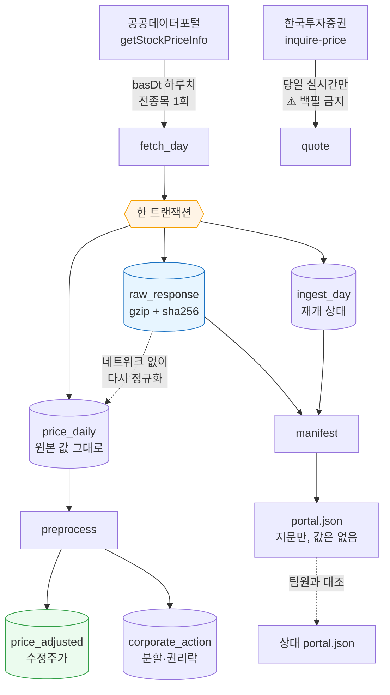

# collector — 시세 수집기

한국 주식 일별 시세를 받아 **원문 그대로 보존**하고, **수정주가**로 정규화한다.
2026-09-22 가동을 목표로 만들었다.

> 이 문서의 모든 수치는 2026-09-19 에 **직접 호출해 얻은 실측값**이다. 추측한 값은
> 없고, 확인하지 못한 것은 "모른다" 라고 적었다.

---

## 1. 5분 만에 돌려 보기

```bash
# 1) 자료가 있는지부터 확인 — 아무것도 받지 않는다
python -m collector.backfill status

# 2) 최근 2주치를 받아 본다 (14회 호출, 하루 한도 10,000 중)
python -m collector.backfill recent

# 3) 과거 구간을 받는다. 끊겨도 다시 실행하면 이어서 간다
python -m collector.backfill backfill --from 20200101 --to 20261231

# 4) 수정주가를 만든다 (분할·권리락 보정)
python -m collector.preprocess

# 5) 지문을 남긴다 — 팀원과 "같은 자료를 봤는가" 맞출 때
python -m collector.manifest write
```

필요한 것은 `.env` 의 `DATA_GO_KR_API_KEY` **하나**다. Postgres·Redis·Qdrant·Neo4j·
Ollama 는 **하나도 필요 없다.**

---

## 2. 왜 앱과 따로 도는가

Qurious 본체는 다섯 개 서비스가 떠 있어야 `import` 조차 된다. 수집은 그 중 아무것도
필요 없다 — 필요한 것은 API 키와 디스크뿐이다.

수집기를 스택에 묶어 두면 **스택이 안 뜨는 날의 시세를 통째로 놓친다.** 놓친 시세는
사람이 기억해서 메꿔야 하고, 결국 안 메꾼다. 그래서 `collector` 는 표준 라이브러리와
`requests` 만 쓴다.

```
바꾸기 전 (스택에 묶인 모양)                바꾼 뒤 (이 설계)
────────────────────────────                ────────────────────────────
app/config.py                               collector/config.py
  ├─ Postgres  ─┐                             └─ .env 한 줄만 읽는다
  ├─ Redis      │  하나라도 안 뜨면
  ├─ Qdrant     ├─ import 실패              collector/db.py
  ├─ Neo4j      │                             └─ SQLite 파일 하나
  └─ Ollama    ─┘
       ↓                                           ↓
  수집 태스크                                 python -m collector.backfill
  (스택 없이는 못 돈다)                       (아무 것도 없이 돈다)
                                                   ↓
                                            app/tasks/collector_tasks.py
                                              └─ 스택이 있을 때만 얹는 얇은 어댑터
```

**요점은 코어가 스케줄러도 DB 스택도 모른다는 것이다.** 그래서 CLI·Windows 작업
스케줄러·Celery Beat 어느 쪽에 붙여도 같은 코드가 돈다.

---

## 3. 데이터가 흐르는 길



셋이 **한 트랜잭션에** 들어가는 것이 핵심이다. 원문만 남고 상태가 안 남으면 다음
실행이 같은 날을 또 받아 유량을 두 배로 쓴다. 상태만 남고 원문이 안 남으면 재정규화가
불가능해진다.

---

## 4. 코드 재사용 판정

| 가져온 곳 | 줄 수 | 판정 | 무엇을·왜 |
|---|---:|---|---|
| [`Alpha_Stack/common/raw_store.py`](https://github.com/devlee328288/Alpha_Stack/blob/3bb08f8/common/raw_store.py) | 300 | 🟢 **이식** → `collector/raw_store.py` (198줄) | gzip+sha256 보존·무결성 검증·통계를 그대로. **바꾼 곳**: ① 연결을 스스로 열던 길을 막고 `conn` 을 **반드시** 받게 했다(트랜잭션을 함께 묶으려고) ② `ALLOWED_SOURCES` 를 이 프로젝트 출처로 교체 ③ `common.paths`·`ingest.store.migrations` 의존 제거(그 패키지가 여기 없다) |
| [`Qurious/app/services/brokers/kis.py`](https://github.com/devlee328288/Qurious/blob/b41fda1/app/services/brokers/kis.py) | 190 | 🟡 **규격만 재사용** → `collector/sources/kis.py` (241줄) | 엔드포인트 경로·TR ID(`FHKST01010100`·`VTTC8434R`)·응답 필드 이름을 그대로 썼다. **코드는 다시 썼다** — 원본은 `httpx` 비동기에 `app.config` 를 import 해서 스택 없이는 못 돈다. 그리고 원본에는 **`rt_cd` 검사가 없다**(`r.json()["output"]` 을 바로 꺼낸다). 유량 초과가 HTTP 500 + 빈 배열로 오므로 그 경로는 조용히 틀린다 |
| [`Qurious/app/celery_app.py`](https://github.com/devlee328288/Qurious/blob/b41fda1/app/celery_app.py) | 74 | 🟢 **그대로 얹음** | Beat 스케줄에 3줄 추가. `timezone="Asia/Seoul"` 이 이미 잡혀 있어 KST 로 그냥 돈다 |
| [`Qurious/app/tasks/ingest_tasks.py`](https://github.com/devlee328288/Qurious/blob/b41fda1/app/tasks/ingest_tasks.py) | 151 | 🟢 **패턴 모방** → `app/tasks/collector_tasks.py` (83줄) | 태스크 안에서 늦게 import 하는 방식을 따랐다. 단 `asyncio.run` 은 안 쓴다 — 수집 코어가 동기라서 |
| [`edumgt/stock-coin-trade` `scheduler.py`](https://github.com/edumgt/stock-coin-trade/blob/ebb40c3/python-stock-backend/scheduler.py) | 72 | 🔴 **쓰지 않음** | APScheduler 선례였지만, 이 저장소에 **이미 Celery Beat 가 돌고 있다**. 스케줄러를 하나 더 들이면 같은 일을 하는 물건이 둘이 되고 "어느 쪽이 안 돌았나" 를 찾는 일이 늘어난다 |
| [`Alpha_Stack/scripts/upload_to_hf.py`](https://github.com/devlee328288/Alpha_Stack/blob/3bb08f8/scripts/upload_to_hf.py) · [`supply/hf_model_data.py`](https://github.com/devlee328288/Alpha_Stack/blob/3bb08f8/supply/hf_model_data.py) · [`scripts/check_hf_access.py`](https://github.com/devlee328288/Alpha_Stack/blob/3bb08f8/scripts/check_hf_access.py) | 890 / 278 / 160 | ⏸ **보류** | HF 업로드 경로다. "팀원이 제3자인가" 가 판단되기 전에는 원자료를 밖으로 내보내지 않는다(§8). 매니페스트(지문)만으로 대조가 되므로 급하지 않다 |

새로 쓴 코드 **1,972줄** 중 이식·모방이 약 **480줄**, 나머지는 새 로직이다.

---

## 5. 전처리 규격 v1 — `vs` 로 조정한다  ★ S26 규격에서 바뀜

### 무엇이 문제인가 (비전문가용)

카카오는 2021년 4월 1주를 5주로 쪼갰다(액면분할). 주가는 558,000 원에서 112,000 원대로
**뚝 떨어진 것처럼** 보인다. 회사 가치는 그대로인데 숫자만 1/5 이 된 것이다. 이걸 그대로
두면 그날 **-80% 대폭락**이 있었던 것으로 기록된다. 그런 가짜 폭락이 섞인 데이터로
전략을 검증하면 검증 결과 자체가 거짓이 된다.

> **액면분할** — 피자를 8조각에서 16조각으로 자른 것이지, 피자가 작아진 게 아니다.
> **조정계수** — 과거 가격에 곱해 오늘 기준으로 맞추는 배수.
> **기준가** — 분할 뒤 첫 거래일에 거래소가 정해 주는 출발 가격.
>   ⚠️ `직전 종가 ÷ 분할비율` 이 **아니다**. 카카오는 558,000÷5 = 111,600 이 아니라 **112,000** 이었다.

### `fltRt`(등락률) 대신 `vs`(전일대비 금액)

S26 규격은 `fltRt` 누적이었다. 실측해 보니 그쪽이 덜 정확하다.

| 기준일 | `vs` 로 역산한 전일가 | `fltRt` 로 역산한 전일가 | 실제 직전 종가 | |
|---|---:|---:|---:|---|
| 20210409 | **548,000.0** | 548,025.9 | 548,000 | `vs` 만 정확 |
| 20210415 | **112,000.0** | 111,999.3 | 558,000 | ← 분할일 |
| 20210420 | **119,000.0** | 119,000.2 | 119,000 | |
| 20210421 | **119,500.0** | 119,505.8 | 119,500 | `vs` 만 정확 |

`fltRt` 는 **소수 둘째 자리까지만** 온다 — 삼성전자 2026-09-17 은 실제 −0.3945% 인데
`"-.39"` 로 잘린다. `vs` 는 정수 원 단위라 자르는 일이 없다. 열 곳 중 `vs` 는 **열 곳
모두** 소수점 이하 0 으로 정확히 맞았다.

그리고 분할일 행을 보면 `vs` 가 **이미 조정된 기준가 기준으로** 계산돼 있다
(120,500 − 8,500 = 112,000). **조정계수를 우리가 추정할 필요가 없다 — 데이터 안에 있다.**

```
조정계수 f = (종가 − 전일대비) ÷ 직전 거래일 종가
누적계수  = 가장 최근 날부터 거꾸로 곱해 나간다 (오늘 가격은 건드리지 않는다)
```

### 이벤트를 세 갈래로 가른다

데이터 안에 **두 번째 독립 신호**가 있다 — 상장주식수(`lstgStCnt`). 분할이면 주식 수가
늘어난 배수만큼 가격이 내려가므로, 가격 계수 `f` 와 주식수 비율 `q` 를 곱하면 1 이 된다.

| 분류 | 조건 | 뜻 | 실측 (2021-04 + 2026-09, 79건) |
|---|---|---|---:|
| `split` | `f·q ≈ 1` | 분할·병합. 두 신호가 일치하므로 **믿어도 된다** | **54건** |
| `rights` | `q ≈ 1` 이고 `f ≠ 1` | **권리락**. 신주는 나중에 상장되므로 그날 주식수는 아직 그대로 | **21건** |
| `review` | 둘 다 어긋남 | 자동 판단하지 않는다 | **4건** |

실제로 잡힌 것들:

| 기준일 | 종목 | 직전종가 | 기준가 | `f` | 주식수비 `q` | 분류 |
|---|---|---:|---:|---:|---:|---|
| 20210415 | 카카오 | 558,000 | 112,000 | 0.200717 | ×5.00 | `split` ✅ |
| 20210421 | 세기상사 | 61,600 | 6,160 | 0.100000 | ×10.00 | `split` ✅ |
| 20210423 | 씨젠 | 195,000 | 98,000 | 0.502564 | ×1.00 | `rights` — 무상증자 권리락 |
| 20210429 | 대한제당 | 7,490 | 3,745 | 0.500000 | ×1.00 | `rights` — 같은 종목에 분할(04-14)과 권리락(04-29)이 둘 다 |
| 20210415 | 한국석유 | 281,000 | 14,550 | 0.051779 | ×10.00 | `review` ⚠️ 1/10 이면 28,100 이어야 한다 |
| 20210408 | 아이엠텍 | 214 | 5,350 | 25.0 | ×0.111 | `review` ⚠️ 아래 참고 |

**🟢 S26 의 열린 질문 하나가 해결됐다** — "권리락에서도 `vs` 가 통하는가". 통한다.
씨젠·대한제당이 실증한다. 다만 권리락일에는 **주식수로 교차검증할 수 없다.**

### 거래정지가 만드는 사각지대 🔴

아이엠텍은 문제를 그대로 보여 준다. 그 구간이 **거래정지라 `vs` 가 계속 0** 이었다.

```
20210401~07   종가    214   vs 0   거래량 0   주식수 43,543,747   ← 정지
20210408      종가  5,350   vs 0   거래량 0   주식수  4,831,715   ← 정지인 채로 값만 바뀜
```

`vs = 0` 이면 "가격이 이어진다" 와 "조정 정보가 없다" 가 **구별되지 않는다.** 정지
해제일에 가격이 달라져 있으면 그것이 조정 때문인지 실제 등락인지 이 데이터만으로는
알 수 없다. 이 경우는 `review` 로 남기고 **사람에게 넘긴다.**

### 거래정지 판별은 출처마다 다르다 ⚠️

| 출처 | 규칙 | 근거 |
|---|---|---|
| 공공데이터포털 | `mkp == 0` **이고** `trqu == 0` | 2026-09-17 하루치에서 각각 147종목, 교집합 **147** — 완전 일치 |
| KIS | `acml_vol == 0` | 시가 필드로는 안 나타난다 (#33) |

한쪽 규칙을 다른 쪽에 그대로 쓰면 정지일을 통째로 놓친다.

### 상장폐지는 지우지 않는다

사라진 종목을 빼고 과거를 보면 "끝까지 살아남은 종목들" 만 남아 수익률이 실제보다 좋아
보인다. 이것을 **생존 편향(survivorship bias)** 이라고 하고, 전략 검증을 통째로 무의미하게
만드는 가장 흔한 원인이다. `collector.preprocess.delisted()` 는 목록을 **보여 줄 뿐
아무것도 지우지 않는다.**

---

## 6. 유량 — 실측으로 좁힌 것

응답 헤더가 남은 횟수를 실어 준다(`X-RateLimit-Limit: 10000`, `X-RateLimit-Remaining`).
문서에 적힌 값이 아니라 **응답이 알려 주는 값**이라 이쪽을 믿는다.

| 시각 (KST) | 남은 유량 | 읽는 법 |
|---|---:|---|
| 09-18 14:4x | 9,790 | |
| 09-18 17:16 | 9,789 | |
| 09-18 18:14 | 9,788 | |
| 09-18 19:26 | 9,770 | **4시간 40분 동안 한 번도 회복 안 됨** → 짧은 주기 리셋 배제 |
| 09-18 종료 | 9,757 | |
| **09-19 11:03** | **9,999** | 한 번 쓰고 남은 값. 즉 직전엔 10,000 → **24시간 롤링 배제** |

롤링이라면 09-18 14:4x 의 호출은 09-19 11:03 에 아직 24시간이 안 지났으므로 9,757
근처여야 한다. 9,999 는 그것을 배제한다.

**🟡 결론: 고정 창이다.** 다만 창이 갈리는 시각이 자정인지 새벽 몇 시인지는 이 관측만으로
특정할 수 없다 — 09-18 19:26 과 09-19 11:03 사이 어딘가다.
**그래서 수집기는 그 시각을 알 필요가 없게 짰다** — 헤더가 주는 남은 횟수만 보고 판단한다.

### 백필 예산

| 항목 | 값 | 근거 |
|---|---:|---|
| 하루치 응답 | 2,870행 · 784,012 B | 2026-09-17 실측 |
| 시장 내역 | KOSPI 942 · KOSDAQ 1,820 · KONEX 108 | **세 시장이 다 들어온다** |
| gzip 후 | 176,719 B (22.5%) | |
| 1,648 거래일 저장량 | **약 278 MB** | 176,719 × 1,648 |
| 필요한 호출 | 1,648회 + 공휴일 약 100회 | 주말은 부르지 않는다(−28%) |
| 하루 한도 대비 | **약 17%** | 하루에 끝난다 |

---

## 7. 포털은 당일 시세를 당일에 주지 않는다 ★ 일정 설계가 바뀐 이유

2026-09-19(토) 11:00 KST 실측:

| basDt | 요일 | totalCount | |
|---|---|---:|---|
| 20260917 | 목 | 2,870 | 있다 |
| **20260918** | **금** | **0** | **거래일인데 없다** |
| 20260913 | 일 | 0 | 휴장일 |
| 20260912 | 토 | 0 | 휴장일 |

**휴장일과 "아직 안 올라온 거래일" 이 똑같이 `resultCode=00` + `totalCount=0` 으로 온다.**
포털은 둘을 구분해 주지 않는다.

여기서 두 가지가 따라 나온다.

1. **"오늘 장 끝나고 오늘 것을 받는" 일정은 성립하지 않는다.** 당일 `basDt` 를 찍으면
   영원히 0건이다. → `recent` 모드로 **최근 2주를 되돌아보며 빈 날만 채운다.** 지연이
   하루든 이틀이든 알아서 메워지고, 지연의 정확한 길이를 알아낼 필요가 없어진다.
2. **빈 응답은 확정이 아니라 보류다.** `SETTLE_DAYS`(10일)가 지나도 비어 있으면 그때
   휴장으로 확정한다. 짧게 잡으면 거래일을 휴장으로 잘못 확정하고, 그 손해가 훨씬 크다.

같은 이유로 **KIS 가 포털의 빈 구간을 메운다** — 2026-09-19 에 KIS 는 09-18 금요일 종가
(삼성전자 260,000)를 이미 주고 있었다. 둘은 겹치지 않고 서로를 채운다.

---

## 8. KIS 로는 백필하지 않는다 — 약관 근거

| 조항 | 내용 | 이 설계에 미친 영향 |
|---|---|---|
| 제5조③ | 시세는 "개인의 업무에 한하여" · **제3자 제공 금지** | 원자료 공유 기본 꺼짐 |
| 제5조② | 키 양도 금지 | 키는 `.env` 에만, 캐시에도 안 담는다 |
| 제9조①4 | **서버 부하 시 이용 중지** | 수천 번 호출하는 백필이 정확히 그 모양 → **금지** |
| 제12조 | 유량은 "회사가 정하여 게시" — **게시된 수치 없음** | 직접 실측: 모의 **초당 약 2건**. 모르는 한도에 대량 호출을 걸지 않는다 |
| 제13조 | **점검 시간엔 잔고가 실제와 다를 수 있다** | 자동매매는 이 창을 피해야 한다 (D7 #13) |
| 제10조①4 | 1년 미사용 시 해지 | |

그래서 KIS 는 **당일 실시간 시세**와 **모의투자 주문·잔고**만 맡는다.

### `rt_cd` 를 먼저 보는 이유

KIS 는 실패해도 HTTP 200 으로 주는 경우가 있고, 유량 초과(`EGW00201`)는 **HTTP 500 에
`output2` 가 빈 배열**로 온다. 상태 코드만 보거나 `output` 을 바로 꺼내면 **빈 결과를
참으로 받아들인다.** 기존 `app/services/brokers/kis.py` 가 그 경로다
([L66-L67](https://github.com/devlee328288/Qurious/blob/b41fda1/app/services/brokers/kis.py#L66-L67)).

---

## 9. 원자료를 밖으로 내보낼 것인가 — `RAW_SHARING` 🔴

**기본은 꺼짐**이고, 켜기 전에 답해야 할 질문이 남아 있다.

- 🔴 **"팀원이 제3자인가"** — 1차 프로젝트 주석은 "private 저장소면 제3자 제공이 아니다"
  였고, 2026-09 에 약관을 다시 읽은 결과는 "팀원도 제3자일 수 있다" 였다.
  **법률 판단이라 우리가 정할 일이 아니다. 강사님께 여쭐 항목이다.**
- 🔴 **공공누리 "변경금지"가 지표 계산까지 막는가** — 미확정.

그때까지 팀은 **매니페스트(지문)만** 주고받으면 된다. 값이 아니라 값의 지문이므로 저장소에
올려도 되고, 그것만으로 "같은 자료를 봤는가" 는 확인된다.

```bash
python -m collector.manifest write                       # 내 지문 남기기
python -m collector.manifest compare --theirs ./their.json  # 어느 날이 다른지
python -m collector.manifest verify                      # 디스크가 썩지 않았는지
```

---

## 10. 지금 확실한 것과 모르는 것

| | 내용 |
|---|---|
| 🟢 | 포털 하루치 전종목이 1회에 들어온다 (2,870행·784KB). 코스피·코스닥·코넥스 전부 |
| 🟢 | `vs` 기반 조정이 **분할·권리락 모두**에서 정확 (카카오·씨젠·대한제당 실증) |
| 🟢 | 유량은 고정 창 리셋. 짧은 주기·24시간 롤링 **배제** |
| 🟢 | 중단·재개가 실제로 동작 (13일 받은 뒤 재실행 → 1회만 호출) |
| 🟢 | 원문 무결성 검사 36건 손상 0 |
| 🟡 | 유량 리셋 **시각**은 미특정 (19:26~11:03 사이) — 설계상 알 필요는 없다 |
| 🟡 | 포털 지연이 **정확히 며칠인지** 미측정 (최소 T+1) |
| 🟡 | `review` 4건(한국석유·아이엠텍·코다코·프리티)의 실제 사유 미확인 |
| 🔴 | **거래정지 중 `vs=0` 구간은 조정 정보가 없다** — 자동 보정 불가 |
| 🔴 | **배당이 안 들어 있다** — 이건 가격수익(PR)이지 총수익(TR)이 아니다 |
| 🔴 | 포털 **오류 응답이 한도를 깎는지** 미확정 |
| 🔴 | 상장폐지 종목의 **사유** 미확보 (KIND 필요) |
| 🟢 | Celery Beat 어댑터 **검증 완료** — Redis 컨테이너로 태스크 3/3 실행 성공 (§12) |

### 이 설계를 뒤집을 조건

- `vs` 기반 조정이 **유상증자 권리락**에서 기준가와 어긋나면 → §5 를 다시 쓴다
  (무상증자는 확인됐고 유상은 아직이다)
- 포털이 **하루치가 3,000행을 넘는 날**을 주면 → `fetch_day` 가 예외로 막는다.
  조용히 잘리지 않으니 그날 안다
- 유량이 **고정 창이 아니라 다른 규칙**으로 드러나면 → 헤더만 보므로 코드는 그대로 둬도 된다

---

## 11. 파일 지도

| 파일 | 줄 | 하는 일 |
|---|---:|---|
| `config.py` | 158 | `.env` 읽기, 경로, 상수. **키는 `unquote` 먼저** |
| `db.py` | 149 | SQLite 표 5개 |
| `raw_store.py` | 198 | 원문 gzip + sha256 보존·검증 |
| `ratelimit.py` | 102 | 호출 간격, 하루 한도, 예비분 |
| `sources/portal.py` | 255 | 포털 하루치 수집 — **백필의 심장** |
| `sources/kis.py` | 241 | KIS 실시간 — `rt_cd` 검사·토큰 캐시 |
| `backfill.py` | 304 | 러너·재개·휴장 확정·CLI |
| `preprocess.py` | 320 | 수정주가·이벤트 분류·상폐 목록 |
| `manifest.py` | 155 | 지문 생성·대조·무결성 |
| `../app/tasks/collector_tasks.py` | 83 | Celery Beat 어댑터 (얇음) |

`data/collector/` 는 `.gitignore` 에 있다 — **원자료는 커밋하지 않는다.**

---

## 12. Celery 경로 검증 — 그리고 찾은 기존 버그

Redis 컨테이너(`redis:7-alpine`, 이미 보유)를 띄워 실제로 돌렸다.

```bash
docker run -d --name qurious-redis-test -p 6399:6379 redis:7-alpine
REDIS_URL=redis://localhost:6399 python -m celery -A app.celery_app worker --pool=solo
#   Windows 에서는 --pool=solo 가 필요하다. 기본 prefork 는 안 돈다
docker stop qurious-redis-test && docker rm qurious-redis-test   # ★ 끝나면 반드시
```

| 태스크 | 결과 |
|---|---|
| `collector.write_manifest` | ✅ 기준일 36일 · 지문 `26688522…` |
| `collector.rebuild_adjusted` | ✅ 종목 3,140 · 행 93,636 · 이벤트 2,378 |
| `collector.portal_recent` | ✅ 최근 5일 확인, 빈 날 1일 재시도 |

### ⚠️ 그 과정에서 기존 버그를 찾았다

처음에는 **셋 다 `NotRegistered` 로 실패**했다. 워커의 `[tasks]` 목록이 **비어 있었다.**

원인은 `app/celery_app.py` 의 `autodiscover_tasks(["app.tasks"])` 다. 이 함수는 기본적으로
각 패키지 아래 **`tasks` 라는 이름의 모듈**(= `app/tasks/tasks.py`)을 찾는데, 그런 파일이
없다. 그래서 **기존 태스크 7개도 하나도 등록되지 않고 있었다** — `ingest.*` 4개,
`sync.*` 2개, `agent.run` 전부.

조용히 실패하는 종류다. 워커는 `ready` 라고 찍고 정상처럼 떠 있는데 아무 일도 안 일어난다.

고친 방법은 `Celery(include=[...])` 로 **모듈을 직접 적는 것**이다. 고친 뒤 `[tasks]` 에
**10개**가 전부 올라왔다(기존 7 + 수집기 3).

> 같은 함정을 한 번 더 겪었다: 첫 워커를 `pkill` 로 죽였다고 생각했는데 Windows 에서는
> 안 죽어, 구·신 워커가 같은 큐를 나눠 먹으며 3건 중 1건만 성공했다. `Get-CimInstance`
> 로 확인해 확실히 종료한 뒤에야 3/3 이 됐다.
